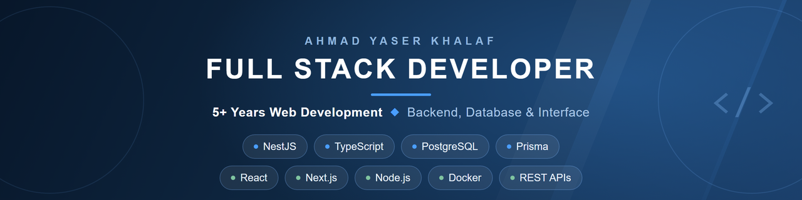

### I build web products end-to-end — from database schema to production UI.

---

Full Stack Developer with **5+ years building production web applications**.

I work across the whole request path — NestJS services and REST APIs, PostgreSQL data models, and React / Next.js interfaces — with strict TypeScript on both ends.

---

## 🧰 Stack at a Glance

**Backend &amp; Data**

**Frontend**

**Tooling &amp; Infrastructure**

---

## 🚀 Core Stack

### Backend &amp; APIs
- NestJS — modules, controllers, services
- Node.js / Express.js
- REST API design
- JWT authentication, guards &amp; role-based access
- Validation pipes &amp; DTOs
- WebSockets (Socket.IO)

### Databases
- PostgreSQL — relational modeling &amp; migrations
- Prisma ORM
- MongoDB / MySQL
- Supabase

### Frameworks
- React 18+
- Next.js (App Router)
- TypeScript (Strict Mode)

### State Management
- React Query (TanStack Query) — Server State
- Zustand — Lightweight Global State
- Redux Toolkit — Enterprise-scale applications

### Forms &amp; Validation
- React Hook Form
- Zod schema validation

### UI &amp; Styling
- TailwindCSS
- shadcn/ui
- MUI
- Responsive &amp; Accessible Design

---

## 🏗 Architecture Approach

I structure applications for scalability and maintainability.

**Frontend**
- Feature-based folder structure
- Typed API abstraction layer
- Custom hooks for business logic isolation
- Centralized error handling
- Optimistic UI updates
- Reusable component systems
- Clean separation of concerns
- Strict typing (no `any`)

**Backend**
- Modular services with clear boundaries
- DTO validation at the edge
- Guards &amp; role-based authorization
- Predictable, consistent REST contracts
- Schema-first data modeling with migrations
- Containerized local environments

Frontend is not just UI — it is system design. The same is true of the API behind it.

---

## 🖥 What I Build

- SaaS Dashboards
- Admin Panels
- Data-driven Platforms
- Form-heavy Systems
- Enterprise UI applications
- Real-time features — chat, live updates, presence

Every project includes:
- Loading &amp; error states
- API caching strategy
- Validation layer — client **and** server
- Scalable state boundaries
- Performance optimization

---

## 🧠 Engineering Philosophy

Clean architecture scales.  
Type safety prevents hidden bugs.  
State should be predictable.  
The contract between client and server should be explicit.  
Software should be maintainable by teams — not just individuals.

I focus on writing code that remains understandable and extensible as products grow.

---

## 📊 GitHub Activity

---

## 🎯 Current Focus

- End-to-end feature delivery across API and UI
- Advanced TypeScript patterns on both ends
- PostgreSQL data modeling with Prisma
- Scalable application architecture
- Performance optimization in Next.js
- Building reusable UI systems

---

## 📫 Contact

📍 Lebanon  
📧 AhmadKhalaf517@gmail.com  
🔗 [LinkedIn](https://linkedin.com/in/ahmad-y-khalaf) · [Portfolio](https://ahmad-khalaf-portfolio.vercel.app)
